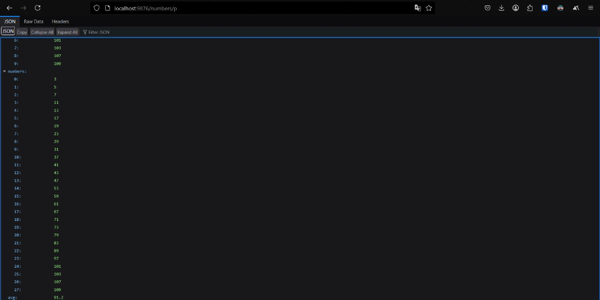
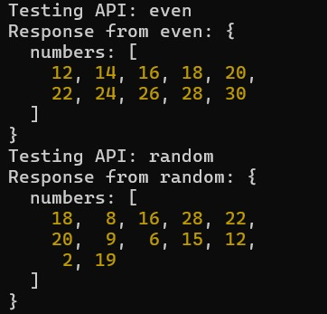

# QUESTION 1 - Backend
# Project: Number Fetching Average Calculator

## Overview
This project is a Node.js-based API server that:
- Fetches different types of numbers from external APIs (Prime, Fibonacci, Even, Random)
- Calculates the average of stored numbers
- Uses authentication to obtain a session token

A test script is also included to validate authentication and API responses.

---

## Installation
### Prerequisites
- [Node.js](https://nodejs.org/) installed
- `npm` package manager

### Setup
1. **Clone the repository:**
   ```sh
   git clone https://github.com/Kaljinx/22051107.git
   cd 22051107
   ```

---

## Running the Server
1. **Start the server:**
   ```sh
   node average.js
   ```
2. **Server will run at:**
   ```
   http://localhost:9876
   ```

### Usage
```sh
http://localhost:9876/numbers/sourceType
http://localhost:9876/numbers/p
http://localhost:9876/numbers/f
```
- `sourceType` can be:
  - `prime - p` 
  - `fibonacci - f`
  - `even - e`
  - `random - r`
  ```

---

## Running the Test Script
The test script verifies authentication and number API responses.

1. **Run the test script:**
   ```sh
   node test.js
   ```
2. **Expected Output:**
   - Authentication token printed
   - Responses from each number API displayed in the terminal
   - 
   - 

---

## Frameworks Used
- Node.js
- Express.js
- Axios

---

## Author
**22051107**

---

## License
This project is open-source. No conidtions

